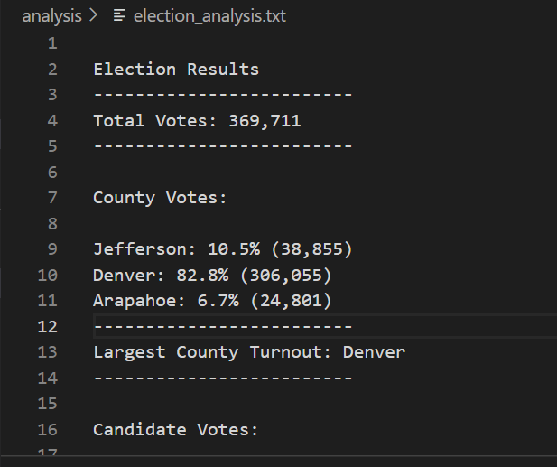
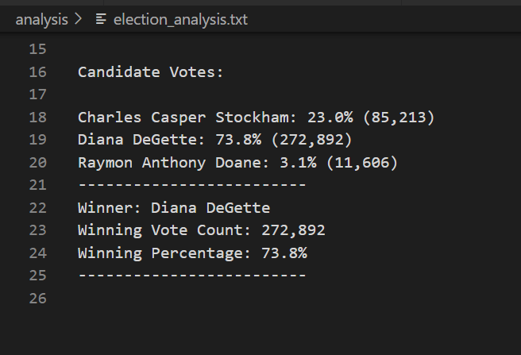

# Election-Analysis

## Overview of Election Audit

- The purpose of the project is to go over the the election analysis data and provide the summary of election results to Colorado Board of Elections. The election results outcome will be used by the board to complete the election audit of recent local congressional election.

Below outcomes of the election analysis are required in order to fullfill the requirement.

1. How many votes were cast in this congressional election?
2. Determine breakdown of number of votes and the percentage of total votes for each county in the precinct. 
3. Which county had the largest number of votes?
4. Determine breakdown of the number of votes and the percentage of the total votes each candidate received
5. Which candidate won the election, what was their vote count, and what was their percentage of the total votes?

## Resources

Below resources are used in order to arrive at precise election results 

- Data Source: election_results.csv
- Software: Python 3.7.6, Visual Studio Code 1.71.0

## Election Audit Results

Ater executing the code below are the outcomes determined.

- Total of 369,711 votes are casted in the congressional electional
    This is calculated by reading the total number of rows in the election analysis results sheet
- Following are total number of votes casted in each county, list of counties and the percentage of votes distribution resulted after code execution 
   Counties participated in the election
    - Jefferson
    - Denver
    - Araphoe
      Outcome of the the County Votes after code execution
      
    
    From the above results it can be inferred that *Denver* county has received highest number of vote percentage of 82.8 and total number of votes counting to 306,055  

- Following are list of candidates participated and total number of votes won for each candidate and the percentage of votes distribution resulted after code execution 
   Candidates participated in the election
    - Charles Casper Stockham
    - Diana DeGette
    - Raymon Anthony Doane
      Outcome of the the County Votes after code execution
     
     
    From the above results outcome *Diana DeGette* gets the maximum number of votes as the wiinging vote count = 272,892 and winning percentage margin = 73.8%

## Election-Audit Summary

From the snapshot of the Election Results Summary captured and the updated python script following conclusion and inference can be made
 
- The current script gives the winning candidate by summing up total votes for each cadidate and comparing total number of votes for all candidates. 
- The winning percentage is calculated based on total number of votes for each candidate against the total votes casted in the election results.
- The same script with minimum update can be used to determine the outcome of not only the county election but a state or country or any other election types.
- If the country election results needs to calculated then dictionary of states votes with key value pair of list of states and number of votes for each state can be retrieved and the same operations performed to find the  winnding candidate and total votes and percentage of votes casted can be used.
- The same script can be used to determine the loosing candidate by iterating over the state/county/city votes 

Text file for Election Reuslts Analysis : [election_analysis.txt](https://github.com/Ghousiya9891/Election-Analysis/tree/main/analysis)

Script for PollChallenge: [PyPoll_Challenge_starter_code.py](https://github.com/Ghousiya9891/Election-Analysis/blob/main/PyPoll_Challenge_starter_code.py)
